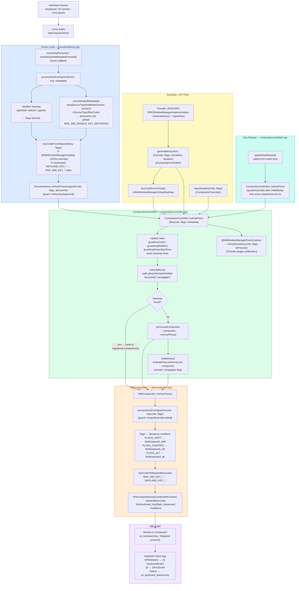
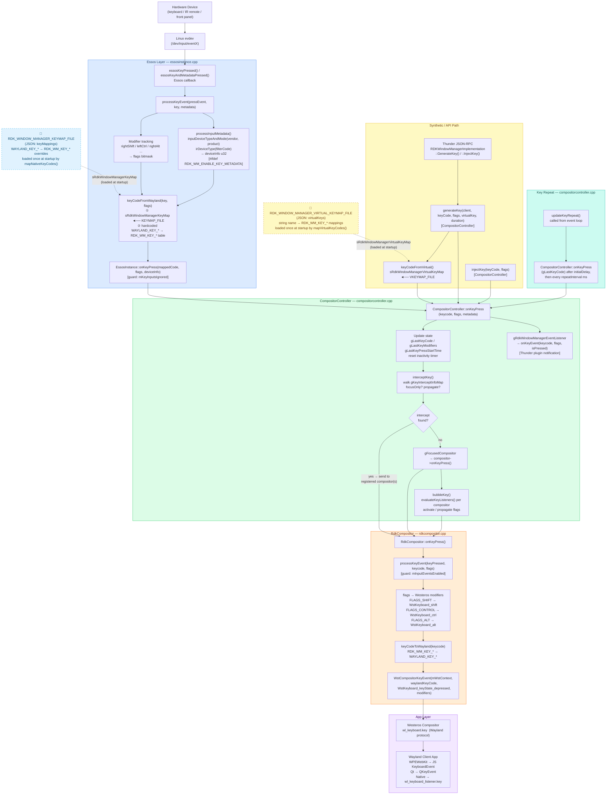

```mermaid
flowchart TD
    HW["Hardware Device\n(keyboard / IR remote / front panel)"]
    EVDEV["Linux evdev\n(/dev/input/eventX)"]

    subgraph ESSOS["Essos Layer  —  essosinstance.cpp"]
        CB["essosKeyPressed() / essosKeyAndMetadataPressed()\nEssos callback"]
        PKE["processKeyEvent(pressEvent, key, metadata)"]
        MOD["Modifier tracking\nrightShift / leftCtrl / rightAlt ...\n→ flags bitmask"]
        META["processInputMetadata()\ninputDeviceTypeAndMode(vendor, product)\nirDeviceType(filterCode)\n→ deviceInfo u32\n[#ifdef RDK_WM_ENABLE_KEY_METADATA]"]
        KFW["keyCodeFromWayland(key, flags)\n① sRdkWindowManagerKeyMap  (JSON override)\n② hardcoded WAYLAND_KEY_* → RDK_WM_KEY_* table"]
        OKP["EssosInstance::onKeyPress(mappedCode, flags, deviceInfo)\n[guard: mKeyInputsIgnored]"]
    end

    subgraph CC["CompositorController  —  compositorcontroller.cpp"]
        CCKP["CompositorController::onKeyPress\n(keycode, flags, metadata)"]
        STATE["Update state\ngLastKeyCode / gLastKeyModifiers\ngLastKeyPressStartTime\nreset inactivity timer"]
        INTC["interceptKey()\nwalk gKeyInterceptInfoMap\nfocusOnly? propagate?"]
        INTC_HIT{"intercept\nfound?"}
        FOCUS["gFocusedCompositor\n→ compositor->onKeyPress()"]
        BUBBLE["bubbleKey()\nevaluateKeyListeners() per compositor\nactivate / propagate flags"]
        GEVT["gRdkWindowManagerEventListener\n→ onKeyEvent(keycode, flags, isPressed)\n[Thunder plugin notification]"]
    end

    subgraph RDKC["RdkCompositor  —  rdkcompositor.cpp"]
        RKCP["RdkCompositor::onKeyPress()"]
        PKE2["processKeyEvent(keyPressed, keycode, flags)\n[guard: mInputEventsEnabled]"]
        FLAG2MOD["flags → Westeros modifiers\nFLAGS_SHIFT → WstKeyboard_shift\nFLAGS_CONTROL → WstKeyboard_ctrl\nFLAGS_ALT → WstKeyboard_alt"]
        KTW["keyCodeToWayland(keycode)\nRDK_WM_KEY_* → WAYLAND_KEY_*"]
        WST["WstCompositorKeyEvent(mWstContext,\n  waylandKeyCode,\n  WstKeyboard_keyState_depressed,\n  modifiers)"]
    end

    subgraph WAPP["App Layer"]
        WLAY["Westeros Compositor\nwl_keyboard.key  (Wayland protocol)"]
        APP["Wayland Client App\nWPEWebKit → JS KeyboardEvent\nQt → QKeyEvent\nNative → wl_keyboard_listener.key"]
    end

    subgraph SYNTH["Synthetic / API Path"]
        INJECT["injectKey(keyCode, flags)\n[CompositorController]"]
        GENKEY["generateKey(client, keyCode, flags, virtualKey, duration)\n[CompositorController]"]
        VMAP["keyCodeFromVirtual()\nsRdkWindowManagerVirtualKeyMap"]
        THUNDER["Thunder JSON-RPC\nRDKWindowManagerImplementation\n::GenerateKey() / ::InjectKey()"]
    end

    subgraph REPEAT["Key Repeat  —  compositorcontroller.cpp"]
        UPD["updateKeyRepeat()\ncalled from event loop"]
        RFIRE["CompositorController::onKeyPress\n(gLastKeyCode) after initialDelay,\nthen every repeatInterval ms"]
    end

    HW --> EVDEV --> CB
    CB --> PKE
    PKE --> MOD
    PKE --> META
    MOD --> KFW
    META --> KFW
    KFW --> OKP
    OKP --> CCKP

    CCKP --> STATE
    STATE --> INTC
    INTC --> INTC_HIT
    INTC_HIT -- "yes → send to\nregistered compositor(s)" --> RKCP
    INTC_HIT -- no --> FOCUS
    FOCUS --> RKCP
    FOCUS --> BUBBLE
    BUBBLE --> RKCP
    CCKP --> GEVT

    RKCP --> PKE2
    PKE2 --> FLAG2MOD
    FLAG2MOD --> KTW
    KTW --> WST
    WST --> WLAY
    WLAY --> APP

    THUNDER --> GENKEY
    GENKEY --> VMAP
    VMAP --> CCKP
    GENKEY --> CCKP
    INJECT --> CCKP

    UPD --> RFIRE
    RFIRE --> CCKP

    style ESSOS fill:#dbeafe,color:#1e3a5f,stroke:#3b82f6
    style CC fill:#dcfce7,color:#14532d,stroke:#22c55e
    style RDKC fill:#ffedd5,color:#7c2d12,stroke:#f97316
    style RDKC fill:#ffedd5,color:#7c2d12,stroke:#f97316
    style WAPP fill:#f3e8ff,color:#3b0764,stroke:#a855f7
    style SYNTH fill:#fef9c3,color:#713f12,stroke:#eab308
    style REPEAT fill:#ccfbf1,color:#134e4a,stroke:#14b8a6
```

```mermaid
flowchart TD
    HW["Hardware Device\n(keyboard / IR remote / front panel)"]
    EVDEV["Linux evdev\n(/dev/input/eventX)"]

    KEYMAP_FILE["📄 RDK_WINDOW_MANAGER_KEYMAP_FILE\n(JSON: keyMappings)\nWAYLAND_KEY_* → RDK_WM_KEY_* overrides\nloaded once at startup by mapNativeKeyCodes()"]
    VKEYMAP_FILE["📄 RDK_WINDOW_MANAGER_VIRTUAL_KEYMAP_FILE\n(JSON: virtualKeys)\nstring name → RDK_WM_KEY_* mappings\nloaded once at startup by mapVirtualKeyCodes()"]

    subgraph ESSOS["Essos Layer  —  essosinstance.cpp"]
        CB["essosKeyPressed() / essosKeyAndMetadataPressed()\nEssos callback"]
        PKE["processKeyEvent(pressEvent, key, metadata)"]
        MOD["Modifier tracking\nrightShift / leftCtrl / rightAlt ...\n→ flags bitmask"]
        META["processInputMetadata()\ninputDeviceTypeAndMode(vendor, product)\nirDeviceType(filterCode)\n→ deviceInfo u32\n[#ifdef RDK_WM_ENABLE_KEY_METADATA]"]
        KFW["keyCodeFromWayland(key, flags)\n① sRdkWindowManagerKeyMap  ◄── KEYMAP_FILE\n② hardcoded WAYLAND_KEY_* → RDK_WM_KEY_* table"]
        OKP["EssosInstance::onKeyPress(mappedCode, flags, deviceInfo)\n[guard: mKeyInputsIgnored]"]
    end

    subgraph CC["CompositorController  —  compositorcontroller.cpp"]
        CCKP["CompositorController::onKeyPress\n(keycode, flags, metadata)"]
        STATE["Update state\ngLastKeyCode / gLastKeyModifiers\ngLastKeyPressStartTime\nreset inactivity timer"]
        INTC["interceptKey()\nwalk gKeyInterceptInfoMap\nfocusOnly? propagate?"]
        INTC_HIT{"intercept\nfound?"}
        FOCUS["gFocusedCompositor\n→ compositor->onKeyPress()"]
        BUBBLE["bubbleKey()\nevaluateKeyListeners() per compositor\nactivate / propagate flags"]
        GEVT["gRdkWindowManagerEventListener\n→ onKeyEvent(keycode, flags, isPressed)\n[Thunder plugin notification]"]
    end

    subgraph RDKC["RdkCompositor  —  rdkcompositor.cpp"]
        RKCP["RdkCompositor::onKeyPress()"]
        PKE2["processKeyEvent(keyPressed, keycode, flags)\n[guard: mInputEventsEnabled]"]
        FLAG2MOD["flags → Westeros modifiers\nFLAGS_SHIFT → WstKeyboard_shift\nFLAGS_CONTROL → WstKeyboard_ctrl\nFLAGS_ALT → WstKeyboard_alt"]
        KTW["keyCodeToWayland(keycode)\nRDK_WM_KEY_* → WAYLAND_KEY_*"]
        WST["WstCompositorKeyEvent(mWstContext,\n  waylandKeyCode,\n  WstKeyboard_keyState_depressed,\n  modifiers)"]
    end

    subgraph WAPP["App Layer"]
        WLAY["Westeros Compositor\nwl_keyboard.key  (Wayland protocol)"]
        APP["Wayland Client App\nWPEWebKit → JS KeyboardEvent\nQt → QKeyEvent\nNative → wl_keyboard_listener.key"]
    end

    subgraph SYNTH["Synthetic / API Path"]
        INJECT["injectKey(keyCode, flags)\n[CompositorController]"]
        GENKEY["generateKey(client, keyCode, flags, virtualKey, duration)\n[CompositorController]"]
        VMAP["keyCodeFromVirtual()\nsRdkWindowManagerVirtualKeyMap  ◄── VKEYMAP_FILE"]
        THUNDER["Thunder JSON-RPC\nRDKWindowManagerImplementation\n::GenerateKey() / ::InjectKey()"]
    end

    subgraph REPEAT["Key Repeat  —  compositorcontroller.cpp"]
        UPD["updateKeyRepeat()\ncalled from event loop"]
        RFIRE["CompositorController::onKeyPress\n(gLastKeyCode) after initialDelay,\nthen every repeatInterval ms"]
    end

    KEYMAP_FILE  -. "sRdkWindowManagerKeyMap\n(loaded at startup)" .-> KFW
    VKEYMAP_FILE -. "sRdkWindowManagerVirtualKeyMap\n(loaded at startup)" .-> VMAP

    HW --> EVDEV --> CB
    CB --> PKE
    PKE --> MOD
    PKE --> META
    MOD --> KFW
    META --> KFW
    KFW --> OKP
    OKP --> CCKP

    CCKP --> STATE
    STATE --> INTC
    INTC --> INTC_HIT
    INTC_HIT -- "yes → send to\nregistered compositor(s)" --> RKCP
    INTC_HIT -- no --> FOCUS
    FOCUS --> RKCP
    FOCUS --> BUBBLE
    BUBBLE --> RKCP
    CCKP --> GEVT

    RKCP --> PKE2
    PKE2 --> FLAG2MOD
    FLAG2MOD --> KTW
    KTW --> WST
    WST --> WLAY
    WLAY --> APP

    THUNDER --> GENKEY
    GENKEY --> VMAP
    VMAP --> CCKP
    GENKEY --> CCKP
    INJECT --> CCKP

    UPD --> RFIRE
    RFIRE --> CCKP

    style ESSOS       fill:#dbeafe,color:#1e3a5f,stroke:#3b82f6
    style CC          fill:#dcfce7,color:#14532d,stroke:#22c55e
    style RDKC        fill:#ffedd5,color:#7c2d12,stroke:#f97316
    style WAPP        fill:#f3e8ff,color:#3b0764,stroke:#a855f7
    style SYNTH       fill:#fef9c3,color:#713f12,stroke:#eab308
    style REPEAT      fill:#ccfbf1,color:#134e4a,stroke:#14b8a6
    style KEYMAP_FILE  fill:#e0f2fe,color:#0c4a6e,stroke:#0ea5e9,stroke-dasharray:5 5
    style VKEYMAP_FILE fill:#fef9c3,color:#713f12,stroke:#ca8a04,stroke-dasharray:5 5
```
